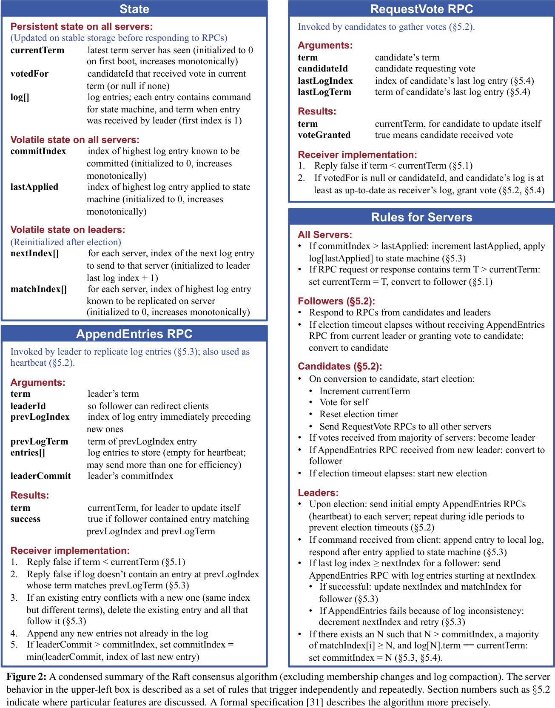
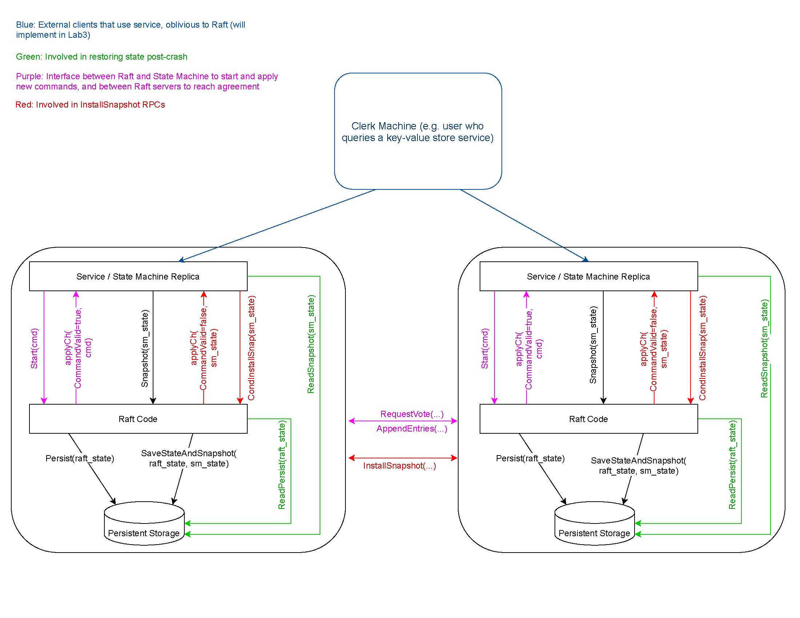
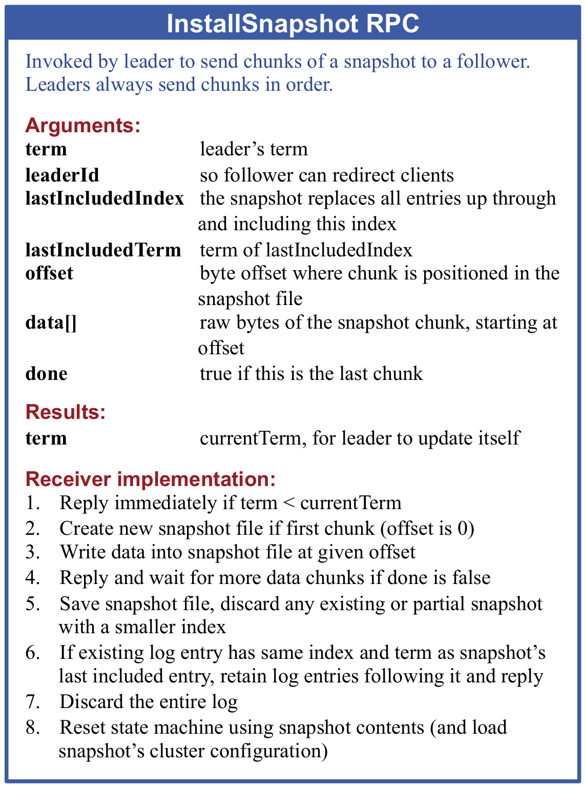
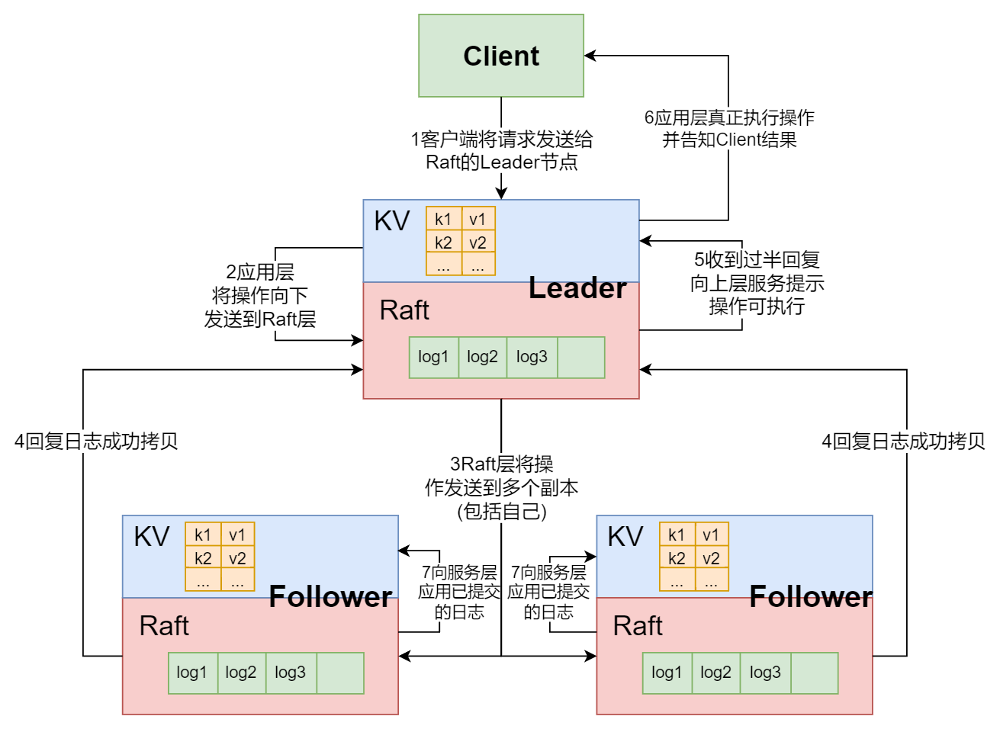

# MIT 6.5840 KV-Raft

<center>
    <b>10215300402 朱维清 & 谷杰 10222140408
</center>

> + 实验完成了 MIT 6.5840 2023 的 Lab1-Lab3A，在各个 test 达成测试 50 次不出错。
>
> + 实验为单进程内，通过 Goroutine 实现 raft servers 节点并发线程，节点间通信通过 RPC 完成。
>
> + 本实验仓库：[MIT-6.5840-KV-raft](https://github.com/VirgilZhu/MIT-6.5840-KV-raft)

## Raft 节点结构体

```go
type Raft struct {
	mu        sync.Mutex          // Lock to protect shared access to this peer's state
	peers     []*labrpc.ClientEnd // RPC end points of all peers
	persister *Persister          // Object to hold this peer's persisted state
	me        int                 // this peer's index into peers[]
	dead      int32               // set by Kill()

	currentTerm int
	votedFor    int
	log         []Entry

	nextIndex   []int         // 复制到某一个follower时, log开始的索引
	matchIndex  []int         // 已经被复制到follower的日志的最高索引
	commitIndex int           // 将要提交的日志的最高索引
	lastApplied int           // 已经被应用到状态机的日志的最高索引
	applyCh     chan ApplyMsg // 用于在应用到状态机时传递消息

	// timeStamp time.Time // 记录收到消息的时间(心跳或append)，通过差值判断是否超时
	voteTimer  *time.Timer
	heartTimer *time.Timer // Lab3A 要求 cmd 能尽快被commit，且要求比一个心跳间隔更快，需要在 SendHeartBeats 函数外控制心跳发送，修改 SendHeartBeats 通过事件触发心跳发送
	//timer *time.Timer
	rd   *rand.Rand
	role int

	//muVote    sync.Mutex // 互斥锁保护投票数据，细化锁粒度
	//voteCount int

	condApply *sync.Cond // 条件变量避免 CommitChecker 线程轮询 commitIndex 忙等，协调日志提交和日志应用的同步

	snapShot          []byte // 快照
	lastIncludedIndex int    // 日志中的最高索引
	lastIncludedTerm  int    // 日志中的最高Term
}
```

其他 Args、RPC 结构体与论文中定义大致相同：



## Lab2A    Leader Election

### 任务描述

>  `Lab2A`部分要求完成的是`Raft`中的`Leader选取`和`心跳函数`。

- **正常运行**
  `Leader`不断发送心跳函数给`Follower`, `Follower`回复, 心跳是通过`AppendEntries RPC`实现的, 其中`entries[]`是空的。
- **选举**
  1. 当指定的心跳间隔到期时， `Follower`转化为`Candidate`并开始进行投票选举, 会为自己投票并自增`term`；
  2. 每一个收到投票请求的`Server`(即包括了`Follower`, `Candidate`或旧的`Leader`), 判断其`RPC`的参数是否符合`Figure2`中的要求, 符合则投票；
  3. 除非遇到了轮次更靠后的投票申请, 否则投过票的`Server`不会再进行投票；
  4. 超过一半的`Server`的投票将选举出新的`Leader`, 新的`Leader`通过心跳`AppendEntries RPC`宣告自己的存在, 收到心跳的`Server`更新自己的状态；
  5. 若超时时间内无新的`Leader`产生, 再进行下一轮投票, 为了避免这种情况, 给不同`Server`的投票超时设定随机值。

### 代码逻辑

> + 一个协程不断检测一个投票间隔内是否接收到心跳或`AppendEntries RPC`, 如果没有接受到, 则发起投票；
> + 处理投票的协程, 发起投票并收集投票结果以改变自身角色；
> + 不断发送心跳的`Leader`的心跳发射器协程；
> + 处理投票请求的`RPC`；
> + 处理心跳的`RPC`；

#### 投票发起方

1. **`ticker`函数**判断是否需要投票（voteTimer 取代原先设计的 timestamp，事件驱动的投票取代轮询+时间差计算，避免忙等 CPU 空转）:

```go
func (rf *Raft) ticker() {
	for !rf.killed() {
		// Your code here (2A)
		// Check if a leader election should be started.
		<-rf.voteTimer.C
		rf.mu.Lock()
		if rf.role != Leader {
			// 超时
			go rf.Elect()
		}
		rf.ResetVoteTimer()
		rf.mu.Unlock()
	}
}
```

2. **`Elect`函数**负责处理具体的投票任务，更新自身节点数据后，构造`RPC`的请求结构体, 异步地对每个`server`发起投票申请:

```go
func (rf *Raft) Elect() {
	rf.mu.Lock()
	defer rf.mu.Unlock()

	rf.currentTerm += 1 // 自增term
	rf.role = Candidate // 成为候选人
	rf.votedFor = rf.me // 给自己投票
	voteCount := 1      // 自己有一票
	//rf.timeStamp = time.Now() // 自己给自己投票也算一种消息
	var muVote sync.Mutex

	DPrintf("server %v 开始发起新一轮投票, 新一轮的term为: %v", rf.me, rf.currentTerm)

	args := &RequestVoteArgs{
		Term:         rf.currentTerm,
		CandidateId:  rf.me,
		LastLogIndex: rf.VirtualLogIdx(len(rf.log) - 1),
		LastLogTerm:  rf.log[len(rf.log)-1].Term,
	}

	for i := 0; i < len(rf.peers); i++ {
		if i == rf.me {
			continue
		}
		go rf.collectVote(i, args, &muVote, &voteCount)
	}
}
```

3. **`collectVote`函数**通过调用**`GetVoteAnswer`函数**处理每个`server`的回复并统计票数，如果成功被选为 leader，初始化两个 volatile data: `nextIndex[]` 和 `matchIndex[]`，并开始发送心跳：

```go
func (rf *Raft) collectVote(serverTo int, args *RequestVoteArgs, muVote *sync.Mutex, voteCount *int) {
	voteAnswer := rf.GetVoteAnswer(serverTo, args)
	if !voteAnswer {
		return
	}
	muVote.Lock()
	if *voteCount > len(rf.peers)/2 {
		muVote.Unlock()
		return
	}

	*voteCount += 1
	if *voteCount > len(rf.peers)/2 {
		rf.mu.Lock()
		if rf.role == Follower {
			// 有另外一个投票的协程收到了更新的term而更改了自身状态为Follower
			rf.mu.Unlock()
			muVote.Unlock()
			return
		}
		DPrintf("server %v 成为了新的 leader", rf.me)
		rf.role = Leader

		// 选出 leader 后初始化两个 volatile data: nextIndex[] 和 matchIndex[]
		for i := 0; i < len(rf.nextIndex); i++ {
			rf.nextIndex[i] = rf.VirtualLogIdx(len(rf.log))
			rf.matchIndex[i] = rf.lastIncludedIndex // 由于matchIndex初始化为lastIncludedIndex, 因此在崩溃恢复后, 大概率触发InstallSnapshot RPC
		}
		rf.mu.Unlock()
		go rf.SendHeartBeats()
	}

	muVote.Unlock()
}
```
4. **`GetVoteAnswer`函数**中，如果`server`回复了更大的`term`, 表示当前这一轮的投票已经废弃, 按照回复更新`term`、自身角色和投票数据 返回`false`：

```go
func (rf *Raft) GetVoteAnswer(server int, args *RequestVoteArgs) bool {
	sendArgs := *args
	reply := RequestVoteReply{}
	ok := rf.sendRequestVote(server, &sendArgs, &reply)
	if !ok {
		return false
	}

	rf.mu.Lock()
	defer rf.mu.Unlock()

	if sendArgs.Term != rf.currentTerm {
		return false
	}

	if reply.Term > rf.currentTerm {
		// 已经是过时的term了
		rf.currentTerm = reply.Term
		rf.votedFor = -1
		rf.role = Follower
		rf.persist()
	}
	return reply.VoteGranted
}
```

#### 投票接收方

投票接收方按照`Figure 2`设计, **RequestVote 函数**逻辑如下:

1. 如果`args.Term < rf.currentTerm`, 直接拒绝投票, 并告知更新的投票

2. 如果`args.Term > rf.currentTerm`, 当前的`server`可能在正处于旧的`term`的选举中,并投给了别人，所以需要更新`rf.votedFor = -1`, 表示自己没有投票

3. 如果满足下面两个情况之一, 投票, 然后更新`currentTerm`, `votedFor`,`role`, `timeStamp `

   + `args.Term > rf.currentTerm`

   + `term == currentTerm`且`LastLogTerm`和`LastLogIndex`位置的条目存在且`term`合法, 并且未投票或者投票对象是自己

4. 其他情况不投票。

```go
func (rf *Raft) RequestVote(args *RequestVoteArgs, reply *RequestVoteReply) {
	// Your code here (2A, 2B).
	rf.mu.Lock()
	defer rf.mu.Unlock()

	if args.Term < rf.currentTerm {
		// 旧的term
		// 1. Reply false if term < currentTerm (§5.1)
		reply.Term = rf.currentTerm
		reply.VoteGranted = false
		DPrintf("server %v 拒绝向 server %v投票: 旧的term: %v,\n\targs= %+v\n", rf.me, args.CandidateId, args.Term, args)
		return
	}

	// args.Term >= rf.currentTerm
    
	if args.Term > rf.currentTerm {
		// 已经是新一轮的term, 之前的投票记录作废
		rf.votedFor = -1
		// （一个发现的bug）防止孤立节点不断超时并发起选举，导致 currentTerm 太大，leader 要发起很多次选举让 term++ 才能超过孤立节点的 currentTerm
		rf.currentTerm = args.Term
		rf.role = Follower
		rf.persist()
	}

	// at least as up-to-date as receiver’s log, grant vote (§5.2, §5.4)
	if rf.votedFor == -1 || rf.votedFor == args.CandidateId {
		// 首先确保是没投过票的
		// 这里需要注意已经 committed 的信息丢失的情况
		if args.LastLogTerm > rf.log[len(rf.log)-1].Term ||
			(args.LastLogTerm == rf.log[len(rf.log)-1].Term && args.LastLogIndex >= rf.VirtualLogIdx(len(rf.log)-1)) {
			// 2. If votedFor is null or candidateId, and candidate’s log is least as up-to-date as receiver’s log, grant vote (§5.2, §5.4)
			rf.currentTerm = args.Term
			reply.Term = rf.currentTerm
			rf.votedFor = args.CandidateId
			rf.role = Follower
			rf.ResetVoteTimer()
			rf.persist()

			reply.VoteGranted = true
			DPrintf("server %v 同意向 server %v投票, args = %+v\n", rf.me, args.CandidateId, args)
			return
		} else {
			if args.LastLogTerm < rf.log[len(rf.log)-1].Term {
				DPrintf("server %v 拒绝向 server %v 投票: 更旧的LastLogTerm, args = %+v\n", rf.me, args.CandidateId, args)
			} else {
				DPrintf("server %v 拒绝向 server %v 投票: 更短的Log, args = %+v\n", rf.me, args.CandidateId, args)
			}
		}
	} else {
		DPrintf("server %v 拒绝向 server %v投票: 已投票, args = %+v\n", rf.me, args.CandidateId, args)
	}

	reply.Term = rf.currentTerm
	reply.VoteGranted = false
}
```

#### 心跳设计

+ **心跳发射器 SendHeartBeats**：当一个`Leader`诞生时, 立即启动心跳发射器, 其不断地调用`AppendEntries RPC`, 只是`Entries`是空的而已：

  > ​	之后这里改为不再调用 `handleHeartBeat` 函数，因为`AppendEntries`和心跳共用同一个发射器, `leader`只需要将从`client`接收的新的日志项追加到`log`中即可, 发射器在每次超时到达后, 从每个`nextIndex[i]`构造`Entries`切片, 如果切片长度为0就是心跳, 不需要显式地判断是心跳或者是真的`AppendEntries`。

```go
func (rf *Raft) SendHeartBeats() {
	DPrintf("server %v 开始发送心跳\n", rf.me)

	for !rf.killed() {
		<-rf.heartTimer.C
		rf.mu.Lock()
		// if the server is dead or is not the leader, just return
		if rf.role != Leader {
			rf.mu.Unlock()
			// 不是leader则终止心跳的发送
			return
		}

		for i := 0; i < len(rf.peers); i++ {
			if i == rf.me {
				continue
			}
			args := &AppendEntriesArgs{
				Term:         rf.currentTerm,
				LeaderId:     rf.me,
				PrevLogIndex: rf.nextIndex[i] - 1,
				//PrevLogTerm:  rf.log[rf.nextIndex[i]-1].Term,
				LeaderCommit: rf.commitIndex,
			}
            
			......
            
			go rf.handleHeartBeat(i, args)
		}
}
```

**handleHeartBeat 函数**也存在函数调用间隙字段被修改的情况, 需要检查`sendArgs.Term != rf.currentTerm`的情况：

```go
func (rf *Raft) handleHeartBeat(serverTo int, args *AppendEntriesArgs) {
	reply := &AppendEntriesReply{}
	sendArgs := *args // 复制一份args结构体
	ok := rf.sendAppendEntries(serverTo, &sendArgs, reply)

	if !ok {
		return
	}

	rf.mu.Lock()
	defer rf.mu.Unlock()
	if sendArgs.Term != rf.currentTerm {
		return
	}

	if reply.Term > rf.currentTerm {
		DPrintf("server %v 旧的leader收到了心跳函数中更新的term: %v, 转化为Follower\n", rf.me, reply.Term)
		rf.currentTerm = reply.Term
		rf.votedFor = -1
		rf.role = Follower
	}
}
```

### 心跳接受方（AppendEntries RPC）

日志复制的逻辑如下（Lab2B 内容）。

#### leader 视角

1. `client`向集群的一个节点发送的命令, 如果不是`leader`, `follower`会通过心跳得知`leader`并返回给`client`
2. `leader`收到了命令, 将其构造为一个日志项, 添加当前节点的`currentTerm`为日志项的`Term`, 并将其追加到自己的`log`中
3. `leader`发送`AppendEntries RPC`将`log`复制到所有的节点, `AppendEntries RPC`需要增加`PrevLogIndex`、`PrevLogTerm`以供`follower`校验, 其中`PrevLogIndex`、`PrevLogTerm`由`nextIndex`确定
4. 如果`RPC`返回了成功, 则更新`matchIndex`和`nextIndex`, 同时寻找一个满足过半的`matchIndex[i] >= N`的索引位置`N`, 将其更新为自己的`commitIndex`, 并提交直到`commitIndex`部分的日志项
5. 如果`RPC`返回了失败, 且伴随的的`Term`更大, 表示自己已经不是`leader`了, 将自身的角色转换为`Follower`, 并更新`currentTerm`和`votedFor`, 重启计时器
6. 如果`RPC`返回了失败, 且伴随的的`Term`和自己的`currentTerm`相同, 将`nextIndex`自减再重试

#### follower 视角

1. `follower`收到`AppendEntries RPC`后,`currentTerm`不匹配直接告知更新的`Term`, 并返回`false`
2. `follower`收到`AppendEntries RPC`后, 通过`PrevLogIndex`、`PrevLogTerm`可以判断出"`leader`认为自己`log`的结尾位置"是否存在并且`Term`匹配, 如果不匹配, 返回`false`并不执行操作;
3. 如果上述位置的信息匹配, 则需要判断插入位置是否有旧的日志项, 如果有, 则向后将`log`中冲突的内容清除
4. 将`RPC`中的日志项追加到`log`中
5. 根据`RPC`的传入参数更新`commitIndex`, 并提交直到`commitIndex`部分的日志项

> ​	**此外，这里实现了后续快速回退（为了过 Lab2C 的 `TestUnreliableFigure8`，短时间内快速删除与 leader 节点不对齐的 logs 并进行日志同步）、raft snapshot 的功能。**

### 快速回退

​	避免如果有`Follower`的日志不匹配, 每次`AppendEntries RPC`中, `Leader`将其`nextIndex`自减1来重试, 某些情况下导致效率很低的情况。

​	需要`AppendEntries RPC`的回复信息携带更多的字段以加速回退, 即**`Follower`返回更多信息给`Leader`，使 Follower 以`Term`为单位来回退**。

```go
type AppendEntriesReply struct {
	// Your data here (2A).
	Term    int  // currentTerm, for leader to update itself
	Success bool // true if follower contained entry matching prevLogIndex and prevLogTerm
	XTerm   int  // Follower中与Leader冲突的Log对应的Term
	XIndex  int  // Follower中，对应Term为XTerm的第一条Log条目的索引
	XLen    int  // Follower的log的长度
}
```

#### Follower 侧的 AppendEntries（快速回退）

发现 log 冲突时, 恢复的逻辑为:

1. 如果`PrevLogIndex`位置不存在日志项, 通过设置`reply.XTerm = -1`告知`Leader`, 并将`reply.XLen`设置为自身日志长度；
2. 如果`PrevLogIndex`位置日志项存在但`Term`冲突, 通过`reply.XTerm`和`reply.XIndex`分别告知冲突位置的`Term`和这个`Term`在`Follower`中第一次出现的位置：

```go
func (rf *Raft) AppendEntries(args *AppendEntriesArgs, reply *AppendEntriesReply) {
	// Your code here (2A, 2B).
	// 新leader发送的第一个消息
	rf.mu.Lock()
	defer rf.mu.Unlock()

	if args.Term < rf.currentTerm {
		// 1. Reply false if term < currentTerm (§5.1)
		// 有2种情况:
		// - 这是来自旧的leader的消息
		// - 当前节点是一个孤立节点, 因为持续增加 currentTerm 进行选举, 因此真正的leader返回了更旧的term
		reply.Term = rf.currentTerm
		reply.Success = false
		DPrintf("server %v 收到了旧的leader% v 的心跳函数, args=%+v, 更新的term: %v\n", rf.me, args.LeaderId, args, reply.Term)
		return
	}

	// args.Term >= rf.currentTerm

	// 不是旧leader发来的日志同步请求的情况，就需要记录访问时间，重设投票计时
	rf.ResetVoteTimer()

	if args.Term > rf.currentTerm {
		// 新leader的第一个消息
		rf.currentTerm = args.Term
		rf.votedFor = -1    
		rf.role = Follower
		rf.persist()
	}

	if len(args.Entries) == 0 {
		// 心跳函数
		DPrintf("server %v 接收到 leader %v 的心跳: %+v\n", rf.me, args.LeaderId, args)
	} else {
		DPrintf("server %v 收到 leader %v 的的AppendEntries: %+v \n", rf.me, args.LeaderId, args)
	}

	isConflict := false
    
	// 校验PrevLogIndex和PrevLogTerm不合法
	// 2. Reply false if log doesn’t contain an entry at prevLogIndex whose term matches prevLogTerm (§5.3)
	// 快速回退处理
	if args.PrevLogIndex >= rf.VirtualLogIdx(len(rf.log)) {
		// PrevLogIndex位置不存在日志项
		reply.XTerm = -1
		reply.XLen = rf.VirtualLogIdx(len(rf.log)) // Log长度, 包括了已经snapShot的部分
		isConflict = true
		DPrintf("server %v 的log在PrevLogIndex: %v 位置不存在日志项, Log长度为%v\n", rf.me, args.PrevLogIndex, reply.XLen)
	} else if rf.log[rf.RealLogIdx(args.PrevLogIndex)].Term != args.PrevLogTerm {
		// PrevLogIndex位置的日志项存在, 但term不匹配
		reply.XTerm = rf.log[rf.RealLogIdx(args.PrevLogIndex)].Term
		i := args.PrevLogIndex
		for i > rf.lastIncludedIndex && rf.log[rf.RealLogIdx(i)].Term == reply.XTerm {
			i -= 1
		}
		reply.XIndex = i + 1
		reply.XLen = rf.VirtualLogIdx(len(rf.log)) // Log长度, 包括了已经snapShot的部分
		isConflict = true
		DPrintf("server %v 的log在PrevLogIndex: %v 位置Term不匹配, args.Term=%v, 实际的term=%v\n", rf.me, args.PrevLogIndex, args.PrevLogTerm, reply.XTerm)
	}

	if isConflict {
		reply.Term = rf.currentTerm
		reply.Success = false
		return
	}
    
	// 3. If an existing entry conflicts with a new one (same index
	// but different terms), delete the existing entry and all that
	// follow it (§5.3)
	// 4. Append any new entries not already in the log
	// 补充append的业务
    
	// （之前的 bug，在高并发情景下，由于`nextIndex`和`matchIndex`只有在收到回复后才会修改，`AppendEntries RPC-1` 没有收到回复时 Leader 又发送了下一个`AppendEntries RPC-2`，两者是相同的，Follower 收到`RPC2`, 由于`RPC2`和`RPC1`完全相同, 因此其一定不会发生冲突,Follower 会将相同的一个日志项切片追加2次）
    
    //  if len(args.Entries) != 0 && len(rf.log) > args.PrevLogIndex+1 && rf.log[args.PrevLogIndex+1].Term != args.Entries[0].Term {
    //	发生了冲突, 移除冲突位置开始后面所有的内容
    //		rf.log = rf.log[:args.PrevLogIndex+1]
	//}
	//  rf.log = append(rf.log, args.Entries...)
    
    
	//一条一条检查 log，避免 RPC 先后顺序混乱导致的重复 append logs
	for idx, log := range args.Entries {
		ridx := rf.RealLogIdx(args.PrevLogIndex) + 1 + idx
		if ridx < len(rf.log) && rf.log[ridx].Term != log.Term {
			// 某位置发生了冲突, 覆盖这个位置开始的所有内容
			rf.log = rf.log[:ridx]
			rf.log = append(rf.log, args.Entries[idx:]...)
			break
		} else if ridx == len(rf.log) {
			// 没有发生冲突但长度更长了, 直接拼接
			rf.log = append(rf.log, args.Entries[idx:]...)
			break
		}
	}

	if len(args.Entries) != 0 {
		DPrintf("server %v 成功进行append, lastApplied=%v, len(log)=%v\n", rf.me, rf.lastApplied, len(rf.log))
	}

	rf.persist()

	reply.Success = true
	reply.Term = rf.currentTerm

	if args.LeaderCommit > rf.commitIndex {
		// 5.If leaderCommit > commitIndex, set commitIndex = min(leaderCommit, index of last new entry)
		if args.LeaderCommit > rf.VirtualLogIdx(len(rf.log)-1) {
			rf.commitIndex = rf.VirtualLogIdx(len(rf.log) - 1)
		} else {
			rf.commitIndex = args.LeaderCommit
		}
		rf.condApply.Signal() // 唤醒检查commit的协程
	}
}
```

## Lab2B    Log

+ Lab2A 的 `SendHeartBeat` 函数中提到，因为`AppendEntries`和心跳共用同一个发射器（这里修改了原来 Lab2A 中的 `SendHeartBeat` 函数，为每个发送的`follower`单独构建了`AppendEntriesArgs`）
+ `handleHeartBeat` 函数更改为 `handleAppendEntries` 函数，统一处理心跳和`AppendEntries`。

#### handleAppendEntries 函数

需要注意的点：

1. 确定函数调用间隙 term 没有改变，保证 `matchIndex`、`nextIndex` 是安全的；
2. `AppendEntries` 成功，对于 follower、candidate 节点，更新它们的 `matchIndex`、`nextIndex`；
3. `AppendEntries` 之后，需要判断是否可以 commit 新达成大半共识的 logs，并唤醒检查commit的协程 `condApply`；
4. 如果 server 回复 append entries 失败，需要考虑实现了快照（Lab2D）后的快速回退实现。

#### leader 侧的 handleAppendEntries（快速回退）

如果需要回退, `leader`的处理逻辑是:

1. 如果`XTerm == -1`, 表示`PrevLogIndex`位置在`Follower`中不存在`log`, 需要将`nextIndex`设置为`Follower`的`log`长度即`XLen`

2. 如果`XTerm != -1`, 表示`PrevLogIndex`位置在`Follower`中存在`log`但其`Term`为`XTerm`, 与`prevLogTerm`不匹配, 同时`XIndex`表示这个`Term`在`Follower`中第一次出现的位置, 需要如下进行判断:

   + 如果`Follower`中存在`XTerm`, 将`nextIndex`设置为`Follower`中最后一个`term == XTerm`的日志项的下一位

   + 否则, 将`nextIndex`设置为`XIndex`

```go
func (rf *Raft) handleAppendEntries(serverTo int, args *AppendEntriesArgs) {
	reply := &AppendEntriesReply{}
	ok := rf.sendAppendEntries(serverTo, args, reply)
	if !ok {
		return
	}

	rf.mu.Lock()
	defer rf.mu.Unlock()

	if args.Term != rf.currentTerm {
		// 函数调用间隙值变了, 已经不是发起这个调用时的term了
		// 要先判断term是否改变, 否则后续的更改matchIndex等是不安全的
		return
	}

	if reply.Success {
		// server回复成功
		newMatchIdx := args.PrevLogIndex + len(args.Entries)
		if newMatchIdx > rf.matchIndex[serverTo] {
			// 有可能在此期间安装了快照, 导致 rf.matchIndex[serverTo] 本来就更大
			rf.matchIndex[serverTo] = newMatchIdx
		}

		newNextIdx := args.PrevLogIndex + len(args.Entries) + 1
		if newNextIdx > rf.nextIndex[serverTo] {
			// 有可能在此期间安装了快照, 导致 rf.nextIndex[serverTo] 本来就更大
			rf.nextIndex[serverTo] = newNextIdx
		}

        
		// 需要判断是否可以commit
		N := rf.VirtualLogIdx(len(rf.log) - 1)

		for N > rf.commitIndex {
			count := 1 // 1表示包括了leader自己
			for i := 0; i < len(rf.peers); i++ {
				if i == rf.me {
					continue
				}
				if rf.matchIndex[i] >= N && rf.log[rf.RealLogIdx(N)].Term == rf.currentTerm {
					count += 1
				}
			}
			if count > len(rf.peers)/2 {
				// 如果至少一半的follower回复了成功, 更新commitIndex
				break
			}
			N -= 1
		}
		rf.commitIndex = N
		rf.condApply.Signal() // 唤醒检查commit的协程
		return
	}

    // server 回复 append entries 失败
    
	if reply.Term > rf.currentTerm {
		// 回复了更新的term, 表示自己已经不是leader了
		DPrintf("server %v 旧的leader收到了来自 server % v 的心跳函数中更新的term: %v, 转化为Follower\n", rf.me, serverTo, reply.Term)

		rf.currentTerm = reply.Term
		rf.role = Follower
		rf.votedFor = -1
		rf.ResetVoteTimer()
		rf.persist()
		return
	}
    
    if reply.Term == rf.currentTerm && rf.role == Leader {
		// term仍然相同, 且自己还是leader, 表明对应的follower在prevLogIndex位置没有与prevLogTerm匹配的项
		// 将nextIndex自减再在下次心跳重试
		rf.nextIndex[serverTo] -= 1
		rf.mu.Unlock()
		return
	}
}
```

#### 应用到状态机的协程 CommitChecker

条件变量实现，检查是否有新的commit， 不断检查`rf.commitIndex > rf.lastApplied`， 将`rf.lastApplied`递增然后发送到管道`applyCh`。

```go
func (rf *Raft) CommitChecker() {
	// 检查是否有新的commit
	DPrintf("server %v 的 CommitChecker 开始运行", rf.me)
	for !rf.killed() {
		rf.mu.Lock()
		for rf.commitIndex <= rf.lastApplied {
			rf.condApply.Wait()
		}
		msgBuf := make([]*ApplyMsg, 0, rf.commitIndex-rf.lastApplied)
		tmpApplied := rf.lastApplied
		for rf.commitIndex > tmpApplied {
			tmpApplied += 1
			if tmpApplied <= rf.lastIncludedIndex {
				// tmpApplied可能是snapShot中已经被截断的日志项, 这些日志项就不需要再发送了
				continue
			}
			msg := &ApplyMsg{
				CommandValid: true,
				Command:      rf.log[rf.RealLogIdx(tmpApplied)].Cmd,
				CommandIndex: tmpApplied,
				SnapshotTerm: rf.log[rf.RealLogIdx(tmpApplied)].Term,
			}

			msgBuf = append(msgBuf, msg)
		}
		rf.mu.Unlock()

		// 在解锁后可能又出现了SnapShot进而修改了rf.lastApplied
		for _, msg := range msgBuf {
			rf.mu.Lock()
			if msg.CommandIndex != rf.lastApplied+1 {
				rf.mu.Unlock()
				continue
			}
			DPrintf("server %v 准备commit, log = %v:%v, lastIncludedIndex=%v", rf.me, msg.CommandIndex, msg.SnapshotTerm, rf.lastIncludedIndex)

			rf.mu.Unlock()
            
			rf.applyCh <- *msg
            
			rf.mu.Lock()
			rf.lastApplied = msg.CommandIndex
			rf.mu.Unlock()
		}
	}
}
```

## Lab2C    Persistence

​	Lab2C 要求只要修改了`votedFor`, `currentTerm`, `log`中的任意一个则进行持久化，只需要补全 `persist` 和 `readPersist` 函数，并在相应位置调用 `persist` 函数即可。

## Lab2D    Log Compaction

> ​	Lab2D 需要实现的`SnapShot`是在`raft`之上的`service`层提供的，因为`raft`层并不理解状态机内部状态的机制。

`service`与`raft`的交互逻辑如下：

1. **日志复制与应用**
   具体的`service`, 如`Lab3`中将实现的KV存储, 位于`raft`层之上, 通过`Start`发送命令给`Leader`一侧的`raft`层, `Leader`会将日志项复制给集群内的其他`Follower`, `Follower`通过`applyCh`将已经提交的包含命令的日志项向上发送给`Follower`侧的`service`。
2. **快照请求与传输**
   某一时刻， `service`为了减小内存压力，将状态机状态 `sm_state` 封装成一个`SnapShot`并将请求发送给`Leader`一侧的`raft`, `raft`层保存`SnapShot`并截断自己的`log`数组, 当通过心跳发现`Follower`的节点的`log`落后`SnapShot`时, 通过`InstallSnapshot`发送给`Follower`, `Follower`保存`SnapShot`并将快照发送给`service`
3. **持久化存储**
   `raft`之下还存在一个持久化层`Persistent Storage`, 也就是`Make`函数提供的`Persister`, 调用相应的接口实现持久化存储和读取。

---

### Snapshot 设计

​	由于发送`SnapShot`后需要截断日志, 而`raft`结构体中的字段如`commitIndex`, `lastApplied`等存储的仍然是全局递增的索引，故需要添加额外字段：
```go
type Raft struct {
    ...
	snapShot          []byte // 快照
	lastIncludedIndex int    // 日志中的最高索引
	lastIncludedTerm  int    // 日志中的最高Term
}
```

​	将全局真实递增的索引称为`Virtual Index`, 将`log`切片（实际节点当前未被截断的日志部分）使用的索引称为`Real Index`, 如果`SnapShot`中包含的最高索引为 `lastIncludedIndex`，有以下索引转换函数：
```go
func (rf *Raft) RealLogIdx(vIdx int) int {
	return vIdx - rf.lastIncludedIndex
}

func (rf *Raft) VirtualLogIdx(rIdx int) int {
	return rIdx + rf.lastIncludedIndex
}
```

#### Snapshot 函数

​	接收`service`层的快照请求, 并截断自己的`log`数组：

1. 判断是否接受`Snapshot`

   + 快照中不应包含未被提交的日志项，创建`Snapshot`时, 必须保证其`index`小于等于`commitIndex`

   + 创建`Snapshot`时, 必须保证其`index`大于`lastIncludedIndex`, 否则它可能是一个重复的或者更旧的快照请求`RPC`, 应当被忽略

2. 将`snapshot`保存
   因为后续`Follower`可能需要`snapshot`, 以及持久化时需要找到`snapshot`进行保存, 因此此时要保存以便后续发送给`Follower`

3. 除了更新`lastIncludedTerm`和`lastIncludedIndex`外, 还需要检查`lastApplied`是否位于`Snapshot`之前, 如果是, 需要调整到与`index`一致

4. 调用`persist`持久化。

```go
func (rf *Raft) Snapshot(index int, snapshot []byte) {
	// Your code here (2D).
	rf.mu.Lock()
	defer rf.mu.Unlock()

	if rf.commitIndex < index || index <= rf.lastIncludedIndex {
		DPrintf("server %v 拒绝了 Snapshot 请求, 其index=%v, 自身commitIndex=%v, lastIncludedIndex=%v\n", rf.me, index, rf.commitIndex, rf.lastIncludedIndex)
		return
	}

	DPrintf("server %v 同意了 Snapshot 请求, 其index=%v, 自身commitIndex=%v, 原来的lastIncludedIndex=%v, 快照后的lastIncludedIndex=%v\n", rf.me, index, rf.commitIndex, rf.lastIncludedIndex, index)

	// 保存snapshot
	rf.snapShot = snapshot

	rf.lastIncludedTerm = rf.log[rf.RealLogIdx(index)].Term
	// 截断log
	rf.log = rf.log[rf.RealLogIdx(index):] // index位置的log被存在0索引处
	rf.lastIncludedIndex = index
	if rf.lastApplied < index {
		rf.lastApplied = index
	}

	rf.persist()
}
```

### InstallSnapshot RPC



根据图中的描述, 设计`RPC`结构体如下:

```go
type InstallSnapshotArgs struct {
	Term              int         // leader’s term
	LeaderId          int         // so follower can redirect clients
	LastIncludedIndex int         // the snapshot replaces all entries up through and including this index
	LastIncludedTerm  int         // term of lastIncludedIndex snapshot file
	Data              []byte      // [] raw bytes of the snapshot chunk
	LastIncludedCmd   interface{} // 新加的字段, log 数组索引从1开始，用于在0处占位
}

type InstallSnapshotReply struct {
	Term int // currentTerm, for leader to update itself
}
```

#### InstallSnapshot RPC 发送时机

> 当`Leader`发现`Follower`要求回退的日志已经被`SnapShot`截断时, 需要发出`InstallSnapshot RPC`。

1. **SendHeartBeats 函数**发起：`SendHeartBeats`发现`PrevLogIndex < lastIncludedIndex`, 表示其要求的日志项已经被截断, 需要改发送心跳为发送`InstallSnapshot RPC`：

   ```go
   func (rf *Raft) SendHeartBeats() {
   	...
   	for !rf.killed() {
   		...
   		for i := 0; i < len(rf.peers); i++ {
   			...
   			args := &AppendEntriesArgs{
   				Term:         rf.currentTerm,
   				LeaderId:     rf.me,
   				PrevLogIndex: rf.nextIndex[i] - 1,
   				LeaderCommit: rf.commitIndex,
   			}
   
   			sendInstallSnapshot := false
   
   			if args.PrevLogIndex < rf.lastIncludedIndex {
   				// 表示Follower有落后的部分且被截断, 改为发送同步心跳
   				DPrintf("leader %v 取消向 server %v 广播新的心跳, 改为发送sendInstallSnapshot, lastIncludedIndex=%v, nextIndex[%v]=%v, args = %+v \n", rf.me, i, rf.lastIncludedIndex, i, rf.nextIndex[i], args)
   
                   sendInstallSnapshot = true
                   
   			} else if rf.VirtualLogIdx(len(rf.log)-1) > args.PrevLogIndex {
   				// 如果有新的log需要发送, 则就是一个真正的AppendEntries而不是心跳
   				args.Entries = rf.log[rf.RealLogIdx(args.PrevLogIndex+1):]
                   
   				DPrintf("leader %v 开始向 server %v 广播新的AppendEntries, lastIncludedIndex=%v, nextIndex[%v]=%v, args = %+v\n", rf.me, i, rf.lastIncludedIndex, i, rf.nextIndex[i], args)
   			} else {
   				// 如果没有新的log发送, 就发送一个长度为0的切片, 表示心跳
   				DPrintf("leader %v 开始向 server %v 广播新的心跳, lastIncludedIndex=%v, nextIndex[%v]=%v, args = %+v \n", rf.me, i, rf.lastIncludedIndex, i, rf.nextIndex[i], args)
                   
   				args.Entries = make([]Entry, 0)
                   
   			}
   
   			if sendInstallSnapshot {
   				go rf.handleInstallSnapshot(i)
   			} else {
   				args.PrevLogTerm = rf.log[rf.RealLogIdx(args.PrevLogIndex)].Term
   				go rf.handleAppendEntries(i, args)
   			}
   		}
   		...
   	}
   }
   ```

2. **心跳回复处理函数 `handleAppendEntries`**发起：`handleAppendEntries` 进行相应的日志回退时, 如果发现已经回退到`lastIncludedIndex`还不能满足要求, 就需要发送`InstallSnapshot RPC`：

   + **这里有3个情况触发`InstallSnapshot RPC`:**

   1. `Follower`的日志过短(`PrevLogIndex`这个位置在Follower中不存在), 甚至短于`lastIncludedIndex`
   2. `Follower`的日志在`PrevLogIndex`这个位置发生了冲突, 回退时发现即使到了`lastIncludedIndex`也找不到匹配项(大于或小于这个`Xterm`)
   3. `nextIndex`中记录的索引本身就小于`lastIncludedIndex`

   ```go
   func (rf *Raft) handleAppendEntries(serverTo int, args *AppendEntriesArgs) {
   	...
       // server 回复 append entries 失败
       
       if reply.Term == rf.currentTerm && rf.role == Leader {
   		// term仍然相同, 且自己还是leader, 表明对应的follower在prevLogIndex位置没有与prevLogTerm匹配的项
   		// 快速回退的处理
   		if reply.XTerm == -1 {
   			// PrevLogIndex这个位置在Follower中不存在
   			DPrintf("leader %v 收到 server %v 的回退请求, 原因是log过短, 回退前的nextIndex[%v]=%v, 回退后的nextIndex[%v]=%v\n", rf.me, serverTo, serverTo, rf.nextIndex[serverTo], serverTo, reply.XLen)
               
   			if rf.lastIncludedIndex >= reply.XLen {
   				// 由于snapshot被截断，添加InstallSnapshot的处理
   				go rf.handleInstallSnapshot(serverTo)
   			} else {
   				rf.nextIndex[serverTo] = reply.XLen
   			}
   			return
   		}
   
           // 需要找到进行快速恢复的起点日志索引
   		i := rf.nextIndex[serverTo] - 1
   		if i < rf.lastIncludedIndex {
   			i = rf.lastIncludedIndex
   		}
   		for i > rf.lastIncludedIndex && rf.log[rf.RealLogIdx(i)].Term > reply.XTerm {
   			i -= 1
   		}
   
   		if i == rf.lastIncludedIndex && rf.log[rf.RealLogIdx(i)].Term > reply.XTerm {
   			// 要找的位置已经由于snapshot被截断，添加InstallSnapshot的处理
   			go rf.handleInstallSnapshot(serverTo)
   		} else if rf.log[rf.RealLogIdx(i)].Term == reply.XTerm {
   			// 之前PrevLogIndex发生冲突位置时, Follower的Term自己也有
   
   			DPrintf("leader %v 收到 server %v 的回退请求, 冲突位置的Term为%v, server的这个Term从索引%v开始, 而leader对应的最后一个XTerm索引为%v, 回退前的nextIndex[%v]=%v, 回退后的nextIndex[%v]=%v\n", rf.me, serverTo, reply.XTerm, reply.XIndex, i, serverTo, rf.nextIndex[serverTo], serverTo, i+1)
   			rf.nextIndex[serverTo] = i + 1 // i + 1是确保没有被截断的
   		} else {
   			// 之前PrevLogIndex发生冲突位置时, Follower的Term自己没有
   			DPrintf("leader %v 收到 server %v 的回退请求, 冲突位置的Term为%v, server的这个Term从索引%v开始, 而leader对应的XTerm不存在, 回退前的nextIndex[%v]=%v, 回退后的nextIndex[%v]=%v\n", rf.me, serverTo, reply.XTerm, reply.XIndex, serverTo, rf.nextIndex[serverTo], serverTo, reply.XIndex)
   			if reply.XIndex <= rf.lastIncludedIndex {
   				// XIndex位置也被截断了
   				// 添加InstallSnapshot的处理
   				go rf.handleInstallSnapshot(serverTo)
   			} else {
   				rf.nextIndex[serverTo] = reply.XIndex
   			}
   		}
   		return
   	}
   }
   ```

#### InstallSnapshot 发送

1. 需要额外发送 `Cmd`字段, 因为构造0索引时的占位日志项
2. 发送`RPC`时不持有锁
3. 发送成功后, 需要将`nextIndex`设置为`VirtualLogIdx(1)`, 因为0索引处是占位, 其余的部分已经不需要再发送了
4. 需要根据回复检查自己是不是旧`Leader`

```go
func (rf *Raft) handleInstallSnapshot(serverTo int) {
	reply := &InstallSnapshotReply{}

	rf.mu.Lock()
	// DPrintf("server %v handleInstallSnapshot 获取锁mu", rf.me)

	if rf.role != Leader {
		// 自己已经不是Leader了, 返回
		rf.mu.Unlock()
		return
	}

	args := &InstallSnapshotArgs{
		Term:              rf.currentTerm,
		LeaderId:          rf.me,
		LastIncludedIndex: rf.lastIncludedIndex,
		LastIncludedTerm:  rf.lastIncludedTerm,
		Data:              rf.snapShot,
		LastIncludedCmd:   rf.log[0].Cmd,
	}

	rf.mu.Unlock()

	// 发送RPC时不要持有锁
	ok := rf.sendInstallSnapshot(serverTo, args, reply)
	if !ok {
		// RPC发送失败, 下次再触发即可
		return
	}

	rf.mu.Lock()
	defer func() {
		rf.mu.Unlock()
	}()

	if reply.Term > rf.currentTerm {
		// 自己是旧Leader
		rf.currentTerm = reply.Term
		rf.role = Follower
		rf.votedFor = -1
		rf.ResetTimer()
		rf.persist()
		return
	}

	rf.nextIndex[serverTo] = rf.VirtualLogIdx(1)
}
```

#### InstallSnapshot 响应

`InstallSnapshot`响应需要考虑更多的边界情况:

1. 如果是旧`leader`, 拒绝
2. 如果`Term`更大, 证明这是新的`Leader`, 需要更改自身状态, 但不影响继续接收快照
3. 如果`LastIncludedIndex`位置的日志项存在, 即尽管需要创建快照, 但并不导致自己措施日志项, 只需要截断日志数组即可
4. 如果`LastIncludedIndex`位置的日志项不存在, 需要清空切片, 并将0位置构造`LastIncludedIndex`位置的日志项进行占位
5. 需要检查`lastApplied`和`commitIndex` 是否小于`LastIncludedIndex`, 如果是, 更新为`LastIncludedIndex`
6. 完成上述操作后, 需要将快照发送到`service`层
7. 由于`InstallSnapshot`可能是替代了一次心跳函数, 因此需要重设定时器

```go
// InstallSnapshot handler
func (rf *Raft) InstallSnapshot(args *InstallSnapshotArgs, reply *InstallSnapshotReply) {
	rf.mu.Lock()
	defer func() {
		rf.ResetTimer()
		rf.mu.Unlock()
		DPrintf("server %v 接收到 leader %v 的InstallSnapshot, 重设定时器", rf.me, args.LeaderId)
	}()

	// 1. Reply immediately if term < currentTerm
	if args.Term < rf.currentTerm {
		reply.Term = rf.currentTerm
		DPrintf("server %v 拒绝来自 %v 的 InstallSnapshot, 更小的Term\n", rf.me, args.LeaderId)
		return
	}
    
	// 不需要实现分块的RPC

	if args.Term > rf.currentTerm {
		rf.currentTerm = args.Term
		rf.votedFor = -1
		DPrintf("server %v 接受来自 %v 的 InstallSnapshot, 且发现了更大的Term\n", rf.me, args.LeaderId)
	}

	rf.role = Follower

	// 6. If existing log entry has same index and term as snapshot’s last included entry, retain log entries following it and reply
	hasEntry := false
	rIdx := 0
	for ; rIdx < len(rf.log); rIdx++ {
		if rf.VirtualLogIdx(rIdx) == args.LastIncludedIndex && rf.log[rIdx].Term == args.LastIncludedTerm {
			hasEntry = true
			break
		}
	}

	msg := &ApplyMsg{
		SnapshotValid: true,
		Snapshot:      args.Data,
		SnapshotTerm:  args.LastIncludedTerm,
		SnapshotIndex: args.LastIncludedIndex,
	}

	if hasEntry {
		DPrintf("server %v InstallSnapshot: args.LastIncludedIndex= %v 位置存在, 保留后面的log\n", rf.me, args.LastIncludedIndex)

		rf.log = rf.log[rIdx:]
	} else {
		DPrintf("server %v InstallSnapshot: 清空log\n", rf.me)
		rf.log = make([]Entry, 0)
		rf.log = append(rf.log, Entry{Term: rf.lastIncludedTerm, Cmd: args.LastIncludedCmd}) // 索引为0处占位
	}

	// 7. Discard the entire log
	// 8. Reset state machine using snapshot contents (and load snapshot’s cluster configuration)

	rf.snapShot = args.Data
	rf.lastIncludedIndex = args.LastIncludedIndex
	rf.lastIncludedTerm = args.LastIncludedTerm

	if rf.commitIndex < args.LastIncludedIndex {
		rf.commitIndex = args.LastIncludedIndex
	}

	if rf.lastApplied < args.LastIncludedIndex {
		rf.lastApplied = args.LastIncludedIndex
	}

	reply.Term = rf.currentTerm
	rf.applyCh <- *msg
	rf.persist()
}
```

## Lab 3A    Key/value service without snapshots



### 线性一致性

> ​	因为网络问题，client 发出的请求可能会重复、丢包、乱序，而 raft 层无法识别是否出现上述问题，可能 client 以为只执行了一次请求，raft 层的 server 执行了若干次，导致逻辑错误，线性不一致。

+ 如何判断重复请求：
  	首先，`server`需要判断某一个请求是否重复，最简单的方法就是让`clerk`携带一个全局递增的序列号，并且`server`需要在第一次将这个请求应用到状态机时记录这个序列号, 用以判断后续的请求是否重复。由于`clerk`不是并发的, 所以`server`只需要记录某个`clerk`序列号最高的一个请求即可, 序列号更低的请求不会出现, 只需要考虑请求重复的场景。
+ 如何处理重复请求：
  	除了记录某个`clerk`请求的序列号外， 还需要记录执行结果，如果是一个重复的`Get`请求, 其返回的结果应该与其第一次发送请求时一致, 否则将导致线性不一致。如果是重复的`Put`等改变状态机的请求，就不应该被执行。

> 1. **重复的`Put/Append`请求只在第一次出现时应用到状态机；**
> 2. **记录每次应用到状态机的请求结果和序列号。**

### Client（Clerk） 实现

```go
type Clerk struct {
	servers    []*labrpc.ClientEnd
	seq        uint64
	identifier int64
	leaderId   int
}
```

`identifier`和`seq`一起标记了唯一的请求。

#### client RPC 设计

`RPC`请求只需要额外携带`identifier`和`seq`, `RPC`回复则需要携带结果和错误信息:

```go
type PutAppendArgs struct {
	Key        string
	Value      string
	Op         string // "Put" or "Append"
	Seq        uint64
	Identifier int64
}

type PutAppendReply struct {
	Err Err
}

type GetArgs struct {
	Key        string
	Seq        uint64
	Identifier int64
}

type GetReply struct {
	Err   Err
	Value string
}
```

#### Get & Put/Append

不断轮询`server`即可, 如果对方返回了超时错误和通道关闭错误等, 需要重试:

```go
func (ck *Clerk) Get(key string) string {
    args := &GetArgs{Key: key, Seq: ck.GetSeq(), Identifier: ck.identifier}

	for {
        reply := &GetReply{}
        ok := ck.servers[ck.leaderId].Call("KVServer.Get", args, reply)
		......
    	return reply.Value
	}
}


func (ck *Clerk) PutAppend(key string, value string, op string) {
	// You will have to modify this function.
	args := &PutAppendArgs{Key: key, Value: value, Op: op, Seq: ck.GetSeq(), Identifier: ck.identifier}

	for {
		reply := &PutAppendReply{}
		ok := ck.servers[ck.leaderId].Call("KVServer.PutAppend", args, reply)
		if !ok || reply.Err == ErrNotLeader || reply.Err == ErrLeaderOutDated {
			ck.leaderId += 1
			ck.leaderId %= len(ck.servers)
			continue
		}

		switch reply.Err {
		case ErrChanClose:
			continue
		case ErrHandleOpTimeOut:
			continue
		}
		return
	}
}

func (ck *Clerk) Put(key string, value string) {
	ck.PutAppend(key, value, "Put")
}
func (ck *Clerk) Append(key string, value string) {
	ck.PutAppend(key, value, "Append")
}
```

### Server 实现

1. Server 将请求封装后通过接口`Start`交付给`raft`层

   + 如果`raft`层节点不是`Leader`, 返回相应错误

   + 否则继续

2. 等待`commit`信息

   + 信息到达, 根据`commit`信息处理回复

   + 超时, 返回相应错误

`Get/Put RPC handler`只会在`raft`层的`commit`信息到达后才能回复。综上，设计一个线程`ApplyHandler` 不断地接收`raft`层的`commit`日志。`ApplyHandler`需要进行重复`RPC`判别和处理, 并将这个请求的结果（`commit log`）返回给`Get/Put RPC handler`。

```go
type KVServer struct {
	mu         sync.Mutex
	me         int
	rf         *raft.Raft
	applyCh    chan raft.ApplyMsg
	dead       int32                // set by Kill()
	waiCh      map[int]*chan result // 映射 startIndex->ch，等待 commit 信息的 RPC handler 的通道
	historyMap map[int64]*result    // 映射 Identifier->*result，记录某 clerk 的最高序列号的请求的序列号和结果

	maxraftstate int // snapshot if log grows this big
	maxMapLen    int
	db           map[string]string
}

type result struct {
	LastSeq uint64
	Err     Err
	Value   string
	ResTerm int    // 记录 commit 被 apply 时的 term
}
```

#### Get/Put RPC handler

调用`Start`, 等待`commit`信息, 以及超时的错误处理：

```go
func (kv *KVServer) Get(args *GetArgs, reply *GetReply) {
	......
	reply.Value = res.Value
}

func (kv *KVServer) PutAppend(args *PutAppendArgs, reply *PutAppendReply) {
	// Your code here.
	// 先判断是不是leader
	_, isLeader := kv.rf.GetState()
	if !isLeader {
		reply.Err = ErrNotLeader
		return
	}

	opArgs := &Op{Seq: args.Seq, Key: args.Key, Val: args.Value, Identifier: args.Identifier}
	if args.Op == "Put" {
		opArgs.OpType = OPPut
	} else {
		opArgs.OpType = OPAppend
	}

	res := kv.HandleOp(opArgs)
	reply.Err = res.Err
}
```

​	`Get`和`PutAppend`都将请求封装成`Op`结构体, 统一给`HandleOp`处理。

​	`HandleOp`处理`ApplyHandler`发过来的`commit`信息并生成回复, 这里采用管道, 每一个请求将自己创建的管道存储在`waiCh`中, 并在函数结束时清理管道和`waiCh`，注意错误处理:

1. 超时错误
2. 通道关闭错误
3. `Leader`可能过期的错误(`term`不匹配)

```go
func (kv *KVServer) HandleOp(opArgs *Op) (res result) {
	startIndex, startTerm, isLeader := kv.rf.Start(*opArgs)
	if !isLeader {
		return result{Err: ErrNotLeader, Value: ""}
	}

	kv.mu.Lock()

	// 直接覆盖之前记录的chan
	newCh := make(chan result)
	kv.waiCh[startIndex] = &newCh
	DPrintf("leader %v identifier %v Seq %v 的请求: 新建管道: %p\n", kv.me, opArgs.Identifier, opArgs.Seq, &newCh)
	kv.mu.Unlock()

	defer func() {
		kv.mu.Lock()
		delete(kv.waiCh, startIndex)
		close(newCh)
		kv.mu.Unlock()
	}()

	// 等待消息到达或超时
	select {
	case <-time.After(HandleOpTimeOut):
		res.Err = ErrHandleOpTimeOut
		DPrintf("server %v identifier %v Seq %v: 超时", kv.me, opArgs.Identifier, opArgs.Seq)
		return
	case msg, success := <-newCh:
		if success && msg.ResTerm == startTerm {
			res = msg
			return
		} else if !success {
			// 通道已经关闭, 有另一个协程收到了消息 或 通道被更新的RPC覆盖
			DPrintf("server %v identifier %v Seq %v: 通道已经关闭, 有另一个协程收到了消息 或 更新的RPC覆盖, args.OpType=%v, args.Key=%+v", kv.me, opArgs.Identifier, opArgs.Seq, opArgs.OpType, opArgs.Key)
			res.Err = ErrChanClose
			return
		} else {
			// term与一开始不匹配, 说明这个Leader可能过期了
			DPrintf("server %v identifier %v Seq %v: term与一开始不匹配, 说明这个Leader可能过期了, res.ResTerm=%v, startTerm=%+v", kv.me, opArgs.Identifier, opArgs.Seq, res.ResTerm, startTerm)
			res.Err = ErrLeaderOutDated
			res.Value = ""
			return
		}
	}
}
```

#### ApplyHandler

1. 先判断`log`请求的`Identifier`和`Seq`是否在历史记录`historyMap`中是否存在, 如果存在就直接返回历史记录
2. 不存在就需要应用到状态机, 并更新历史记录`historyMap`
3. 如果`log`请求的`CommandIndex`对应的`key`在`waiCh`中存在, 表面当前节点可能是一个`Leader`, 需要将结果发送给`RPC handler`

```go
func (kv *KVServer) ApplyHandler() {
	for !kv.killed() {
		log := <-kv.applyCh

		if log.CommandValid {

			op := log.Command.(Op)
			kv.mu.Lock()

			// 需要判断这个log是否需要被再次应用
			var res result

			needApply := false
			if hisMap, exist := kv.historyMap[op.Identifier]; exist {
				if hisMap.LastSeq == op.Seq {
					// 历史记录存在且Seq相同, 直接套用历史记录
					res = *hisMap
				} else if hisMap.LastSeq < op.Seq {
					// 否则新建
					needApply = true
				}
			} else {
				// 历史记录不存在
				needApply = true
			}

			_, isLeader := kv.rf.GetState()

			if needApply {
				// 执行log
				res = kv.DBExecute(&op, isLeader)
				res.ResTerm = log.SnapshotTerm

				// 更新历史记录
				kv.historyMap[op.Identifier] = &res
			}

			if !isLeader {
				// 不是leader则继续检查下一个log
				kv.mu.Unlock()
				continue
			}
			
            // Follower 到此结束
            
			// Leader还需要额外通知handler处理clerk回复
			ch, exist := kv.waiCh[log.CommandIndex]
			if !exist {
				// 接收端的通道已经被删除了并且当前节点是 leader, 说明这是重复的请求, 但这种情况不应该出现, 所以panic
				DPrintf("leader %v ApplyHandler 发现 identifier %v Seq %v 的管道不存在, 应该是超时被关闭了", kv.me, op.Identifier, op.Seq)
				kv.mu.Unlock()
				continue
			}
			kv.mu.Unlock()
			// 发送消息
			func() {
				defer func() {
					if recover() != nil {
						// 如果这里有 panic，是因为通道关闭
						DPrintf("leader %v ApplyHandler 发现 identifier %v Seq %v 的管道不存在, 应该是超时被关闭了", kv.me, op.Identifier, op.Seq)
					}
				}()
				res.ResTerm = log.SnapshotTerm
				*ch <- res
			}()
		}
	}
}
```

`DBExecute`就是将日志项应用到状态机, 逻辑很简单:

```go
func (kv *KVServer) DBExecute(op *Op, isLeader bool) (res result) {
	// 调用该函数需要持有锁
	res.LastSeq = op.Seq
    
	switch op.OpType {
	case OPGet:
		val, exist := kv.db[op.Key]
		if exist {
			kv.LogInfoDBExecute(op, "", val, isLeader)
			res.Value = val
			return
		} else {
			res.Err = ErrKeyNotExist
			res.Value = ""
			kv.LogInfoDBExecute(op, "", ErrKeyNotExist, isLeader)
			return
		}
	case OPPut:
		kv.db[op.Key] = op.Val
		kv.LogInfoDBExecute(op, "", kv.db[op.Key], isLeader)
		return
	case OPAppend:
		val, exist := kv.db[op.Key]
		if exist {
			kv.db[op.Key] = val + op.Val
			kv.LogInfoDBExecute(op, "", kv.db[op.Key], isLeader)
			return
		} else {
			kv.db[op.Key] = op.Val
			kv.LogInfoDBExecute(op, "", kv.db[op.Key], isLeader)
			return
		}
	}
	return
}
```

## 参考资料

1. [In Search of an Understandable Consensus Algorithm](https://raft.github.io/raft.pdf)
2. [6.5840 Home Page: Spring 2023](http://nil.csail.mit.edu/6.5840/2023/index.html)
3. [Raft算法详解 - 知乎](https://zhuanlan.zhihu.com/p/32052223)
4. [万字长文解析raft算法原理 - 知乎](https://zhuanlan.zhihu.com/p/600147978)
5. [寻找一种易于理解的一致性算法](https://github.com/maemual/raft-zh_cn/blob/master/raft-zh_cn.md)
6. [2020 MIT 6.824 分布式系统哔哩哔哩bilibili](https://github.com/maemual/raft-zh_cn/blob/master/raft-zh_cn.md)
7. [MIT-6.824-2021Lab指导翻译 - 知乎](https://zhuanlan.zhihu.com/p/524338268)

## 小组分工

+ 朱维清：Lab2A、Lab2B、Lab2C
+ 谷杰：Lab1、Lab2D、Lab3A
